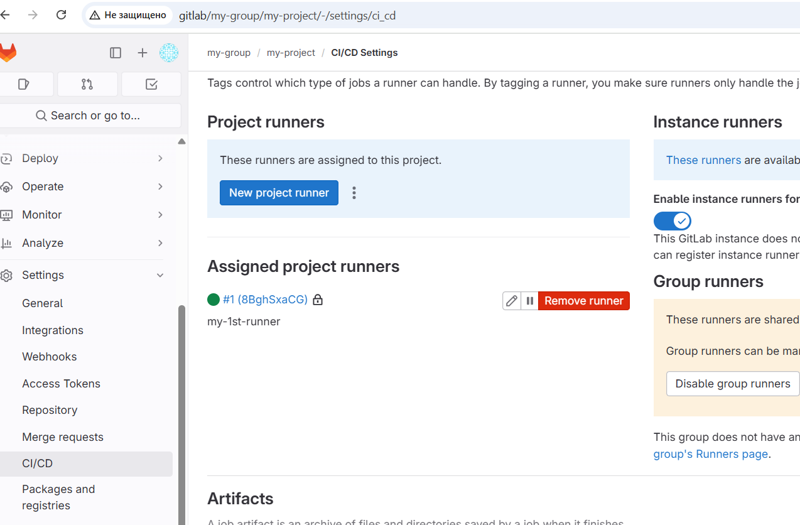
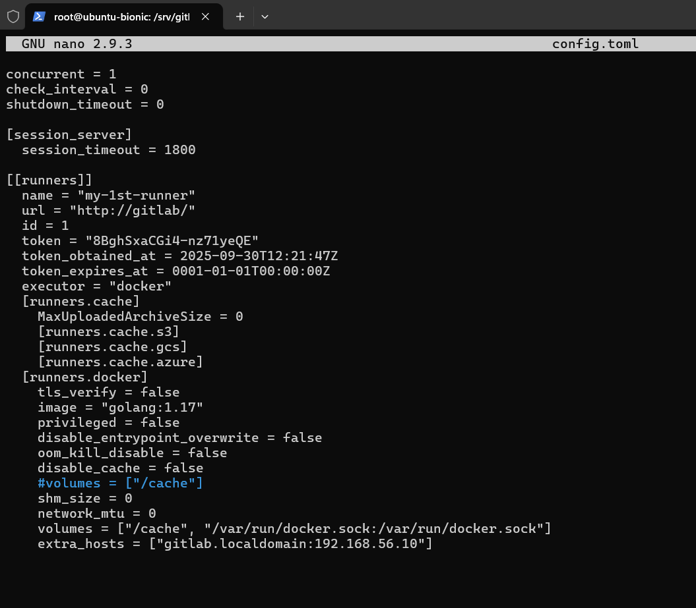
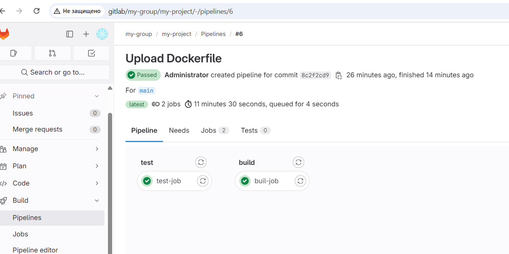
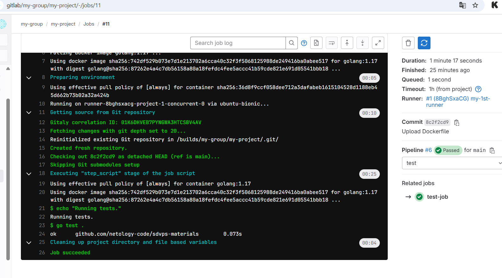
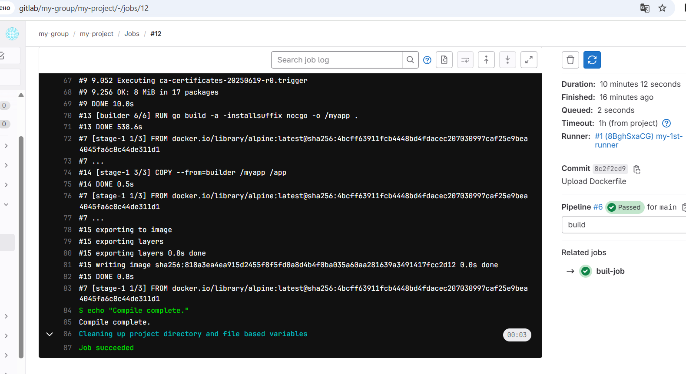

# Домашнее задание к занятию "`GitLab`" - `Милованов Константин`


### Задание 1

`Приведите ответ в свободной форме........`

1. Разверните GitLab локально, используя Vagrantfile и инструкцию, описанные в этом репозитории https://github.com/netology-code/sdvps-materials/tree/main/gitlab.
2. Создайте новый проект и пустой репозиторий в нём.
3. Зарегистрируйте gitlab-runner для этого проекта и запустите его в режиме Docker.

Скриншоты runner и конфиг раннера:




---

### Задание 2

Создайте .gitlab-ci.yml, описав в нём все необходимые, на ваш взгляд, этапы.

В качестве ответа добавьте:
файл gitlab-ci.yml для своего проекта или вставьте код в соответствующее поле в шаблоне, скриншоты с успешно собранными сборками.

Файл .gitlab-ci.yml:

```
stages:
  - test
  - build

test-job:
  stage: test
  image: golang:1.17
  script:
    - echo "Running tests." 
    - go test .

buil-job:
  stage: build
  image: docker:latest
  script:
    - echo "Compiling the code..."
    - docker build .
    - echo "Compile complete."
```

Скриншоты успешных сборок:


Test-job


Build-job


---
